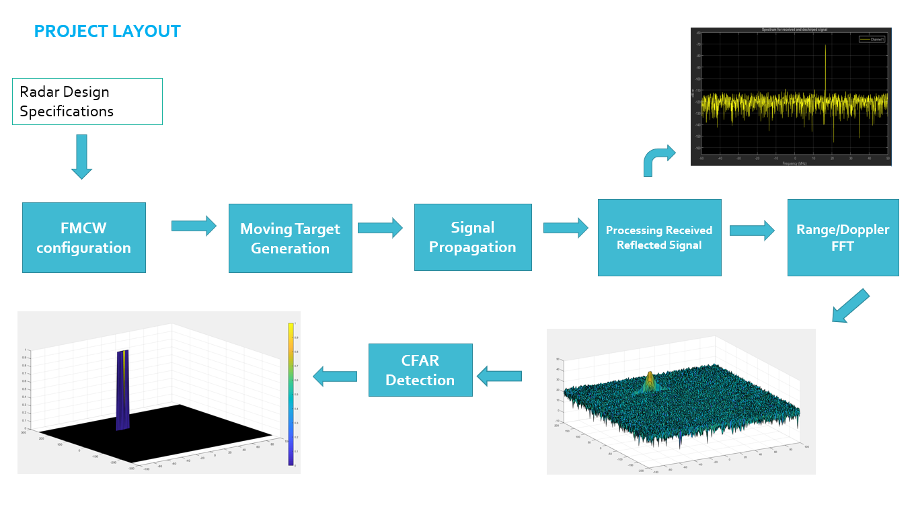
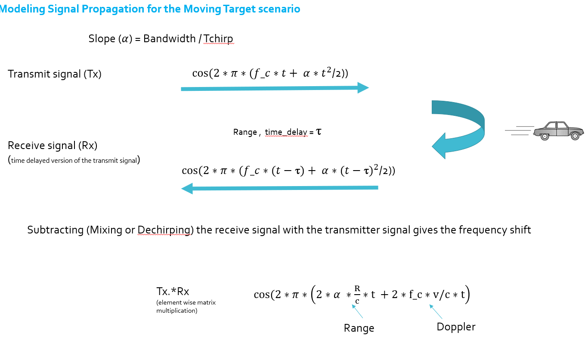
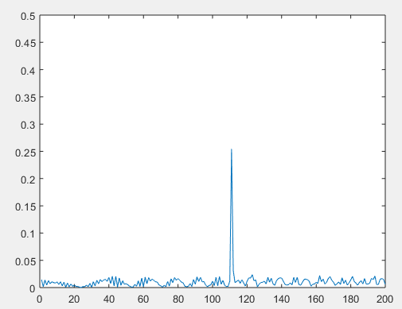
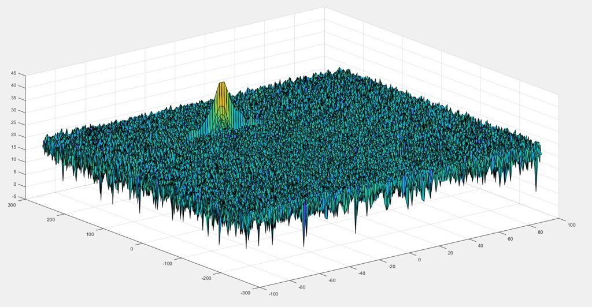
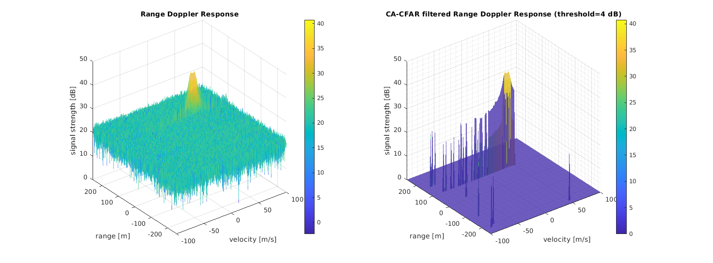
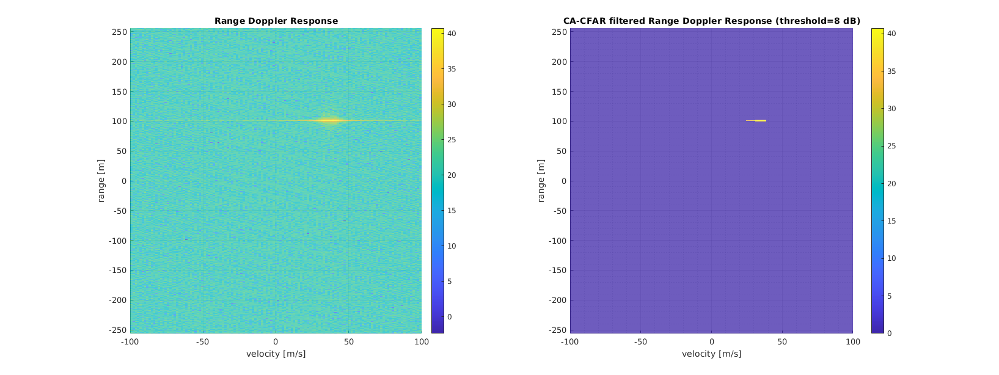

# Radar Target Generation and Detection (2D CA-CFAR)

This project implements 2D [CA-CFAR](https://en.wikipedia.org/wiki/Constant_false_alarm_rate)
(Cell-Averaging Constant False Alarm Rate) to detect target measurements against
a noisy background for a frequency modulated continuous-wave (FMCW) radar.

The following picture shows a FMCW measurement of a target at 100 m distance
with a velocity of 37 m/s. The left plot shows the noisy measurement obtained
from the frequency mixer, whereas the right plot shows the CA-CFAR filtered
Radar response.


---

## Project Overview



> - Configure the FMCW waveform based on the system requirements.
> - Define the range and velocity of target and simulate its displacement.
> - For the same simulation loop process the transmit and receive signal to determine the beat signal
> - Perform Range FFT on the received signal to determine the Range
> - Towards the end, perform the CFAR processing on the output of 2nd FFT to display the target.

<details>

### Radar System Requirements

> The sensor fusion design for different
> driving scenarios requires different system configurations from a Radar. In this project,
> you will designing a Radar based on the given system requirements:
>
> 
>
> Max Range and Range Resolution will be considered here for waveform design.
> - The sweep bandwidth can be determined according to the range resolution and the sweep
>   slope is calculated using both sweep bandwidth and sweep time.
>   ```
>   Bandwidth(B_sweep) = speed of light / (2*rangeResolution)
>   ```
> - The sweep time can be computed based on the time needed for the signal to travel the
>   unambiguous maximum range. In general, for an FMCW radar system, the sweep time should
>   be at least 5 to 6 times the round trip time. This example uses a factor of 5.5.
>   ```
>   T_chirp = 5.5 * 2 * R_max / c
>   ```
>   Giving the slope of the chirp signal
>   ```
>   Slope=Bandwidth/T_chirp
>   ```
>
> #### Initial Range and velocity of the Target
>
> You will provide the initial range and velocity of the target.
> Range cannot exceed the max value of 200m and velocity can be
> any value in the range of -70 to + 70 m/s.

### Target Generation and Detection

> Next, you will be simulating the signal propagation and moving target scenario.
>
> 
>
> #### Theory
>
> In terms of wave equation, FMCW transmit and received signals are defined using
> these wave equations, where `α = Slope of the signal`.
> The Transmit Signal is given by:
>
> 
>
> The received signal is nothing but the time delayed version of the Transmit Signal.
> In digital signal processing the time delayed version is defined by (t−τ),
> where τ represents the delay time, which in radar processing is the trip time for the signal.
> Replacing t with (t−τ) gives the Receive Signal:
>
> 
>
> On mixing these two signals, we get the beat signal, which holds the values for both
> range as well as doppler. By implementing the 2D FFT on this beat signal,
> we can extract both Range and Doppler information.
>
> The beat signal can be calculated by multiplying the Transmit signal with Receive signal.
> This process in turn works as frequency subtraction. It is implemented by element by element
> multiplication of transmit and receive signal matrices.
> ```
> Mixed or Beat Signal = Tx .* Rx
> ```
> The above operation gives:
>
> 

### FFT Operation

> - Implement the 1D FFT on the Mixed Signal
> - Reshape the vector into Nr*Nd array.
> - Run the FFT on the beat signal along the range bins dimension (Nr)
> - Normalize the FFT output.
> - Take the absolute value of that output.
> - Keep one half of the signal
> - Plot the output
> - There should be a peak at the initial position of the target
>
> 
>
> The 2nd FFT is already implemented in the code.
> It will generate a Range Doppler Map as seen in the image below and it will be given by
> variable `RDM`. Next task is to implement the CFAR on this Range Doppler Map.
>
> 

### 2D CFAR

> - Determine the number of Training cells for each dimension. Similarly, pick the number of guard cells.
> - Slide the cell under test across the complete matrix. Make sure the CUT has margin for Training and Guard cells from the edges.
> - For every iteration sum the signal level within all the training cells. To sum convert the value from logarithmic to linear using db2pow function.
> - Average the summed values for all of the training cells used. After averaging convert it back to logarithmic using pow2db.
> - Further add the offset to it to determine the threshold.
> - Next, compare the signal under CUT against this threshold.
> - If the CUT level > threshold assign it a value of 1, else equate it to 0.

The process above will generate a thresholded block, which is smaller than the Range Doppler Map as the CUTs cannot be located at the edges of the matrix due to the presence of Target and Guard cells. Hence, those cells will not be thresholded.

> - To keep the map size same as it was before CFAR, equate all the non-thresholded cells to 0.
>
> 
>
> Once you have completed this, you are done.

## Project Rubric

### FMCW Waveform Design

- **Criteria:** Using the given system requirements, design
a FMCW waveform. Find its Bandwidth (B), chirp time (Tchirp) and slope of the chirp.

  **Meets Specification:** For given system requirements the calculated slope should be around 2e13

### Simulation Loop

- **Criteria:** Simulate Target movement and calculate the beat or mixed signal for every timestamp.

  **Meets Specifications:** A beat signal should be generated such that once range FFT implemented, it gives the correct range i.e the initial position of target assigned with an error margin of +/- 10 meters.

### Range FFT (1st FFT)

- **Criteria:** Implement the Range FFT on the Beat or Mixed Signal and plot the result.

  **Meets Specifications:** A correct implementation should generate a peak at the correct range, i.e the initial position of target assigned with an error margin of +/- 10 meters.

### 2D CFAR

- **Criteria:** Implement the 2D CFAR process on the output of 2D FFT operation, i.e the Range Doppler Map.

  **Meets Specifications:** The 2D CFAR processing should be able to suppress the noise and separate the target signal. The output should match the image shared in walkthrough.

- **Criteria:** Create a CFAR README file.

  **Meets Specifications:** In a README file, write brief explanations for the following:
  - Implementation steps for the 2D CFAR process.
  - Selection of Training, Guard cells and offset.
  - Steps taken to suppress the non-thresholded cells at the edges.

---

</details>

## Project Implementation

Given the specifications above and a sweep-to-roundtrip factor of 5.5 (given in the lectures
as a typical value for an FMCW radar system), the following values were determined:

- **Sweep bandwidth:** 150 MHz
- **Chirp time:** 7.33 μs (7.3333e-06 s)
- **Frequency drift / slope:** 20.45 THz/s (2.045e13 Hz/s)

For the following simulation, a target was defined with the following parameters:

- **Distance:** 100 m
- **Velocity:** 37 m/s

After simulating the beat signal was been for every time step, the Fourier transformation of it
was taken in order to determine the distance to target. This resulted in a peak at

- **Estimated distance:** 101 m

Next, CA-CFAR was implemented as a march over each range/doppler cell (the cell-under-test, CUT),
taking the integral of the training cells around it. The scan was limited to the extents of the
CFAR signal storage array and normalization was done by the number of valid cells examined.
Due to this procedure and since the CFAR signal array was initialized to zero, no edge suppression
was required. If a signal were to be received in these edge areas however, we would have to expect
slightly degraded results since a lower number of training cells is involved.

In the next step, the mean noise level of the sampled cells was determined, converted from
power to dB scale and compared against a threshold. Cells below threshold were suppressed, whereas
cell values equal to or above threshold were kept. Note that this differs from the project description
in that no further normalization is done here (specifically, good values are not simply set to one).
Using the CFAR array as a multiplicative mask would be certainly possible with the approach
described in the project, but the end result would be the same.

Initially, the following setup was used by arbitrarily picking values from the lessons as defaults
and determining a threshold by fair dice roll:

- **Distance training cells:** 8
- **Distance guard cells:** 4
- **Doppler training cells:** 8
- **Doppler training cells:** 4
- **Threshold:** 4 dB

This resulted in the following outcome:



As can be seen, the correct spike was kept, but is very wide along the velocity
axis; in addition, a couple of false positives were kept as well.

Since the estimate along the range axis was very sharp and spot on, the
number of doppler training cells was increased to suppress velocity errors better.
In addition, the threshold was increased to 8 dB, such that

- **Distance training cells:** 8
- **Distance guard cells:** 4
- **Doppler training cells:** 8
- **Doppler training cells:** 8
- **Threshold:** 8 dB

The result - as already shown in the very beginning of this README - is this plot.
As can be seen, the spike at 100 m and 37 m / s is reasonably sharp, although the
precision along the doppler / velocity axis could be better:


Here's the same scenario in a top view:


